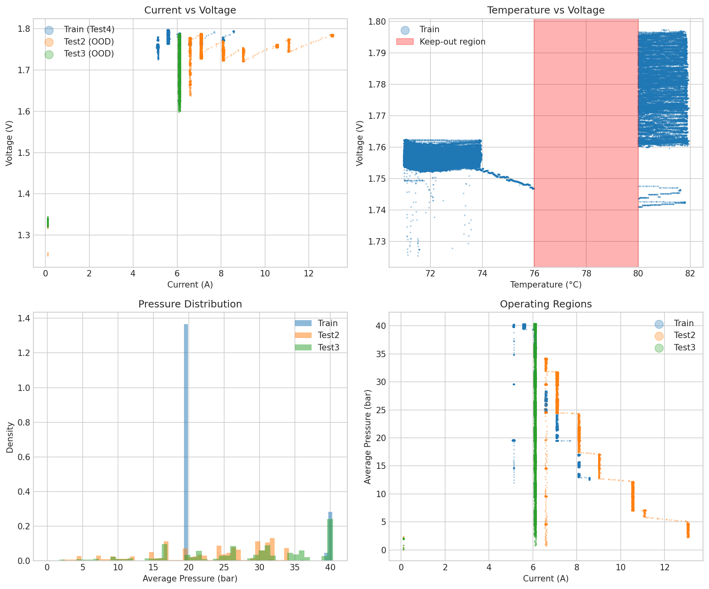
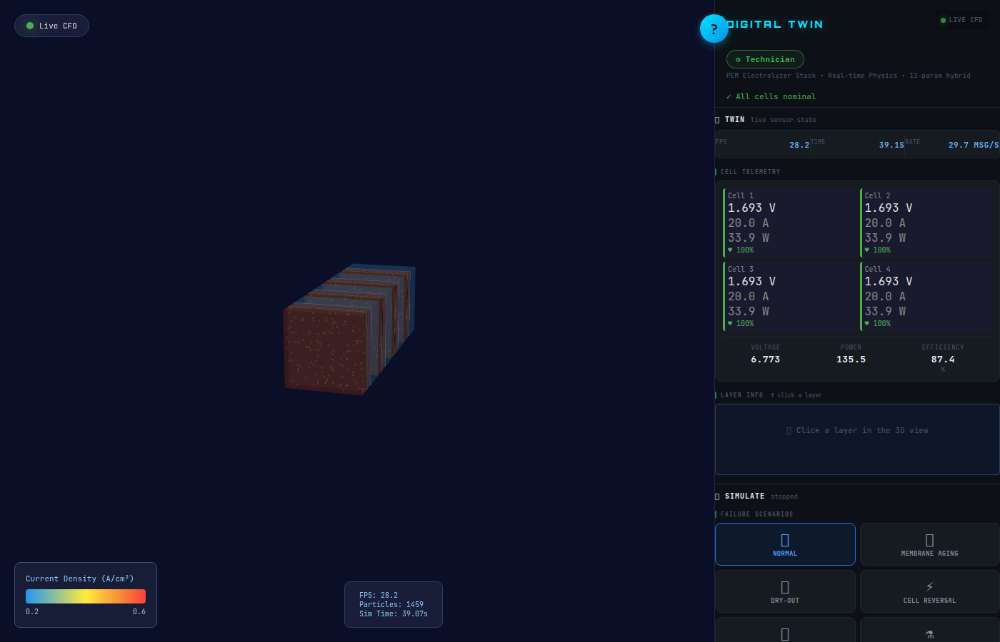
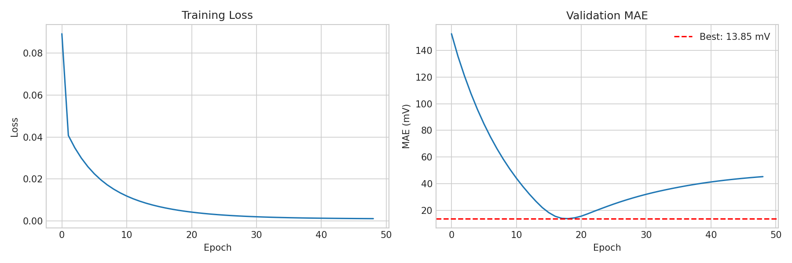
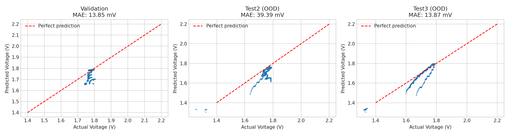
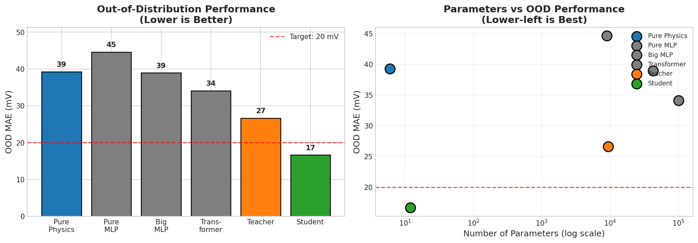
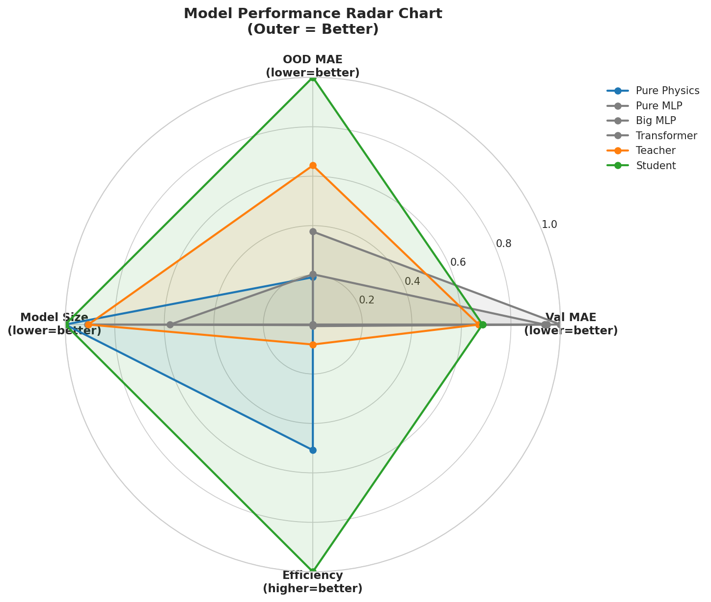
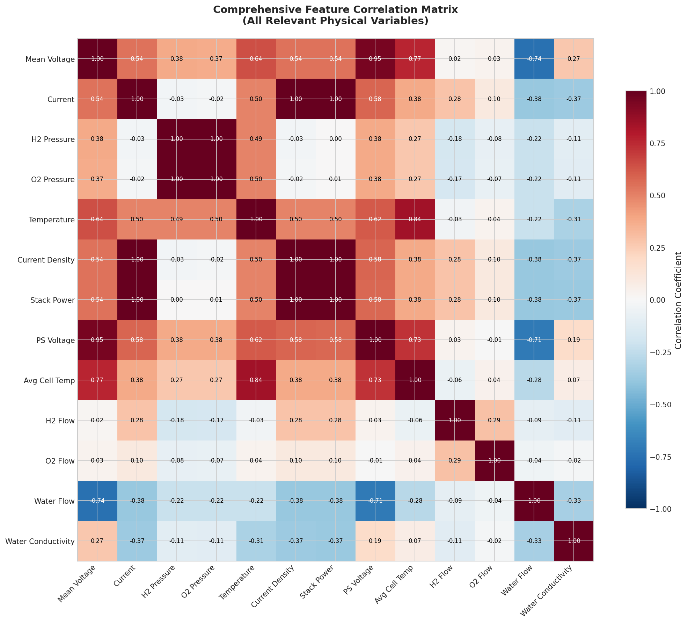
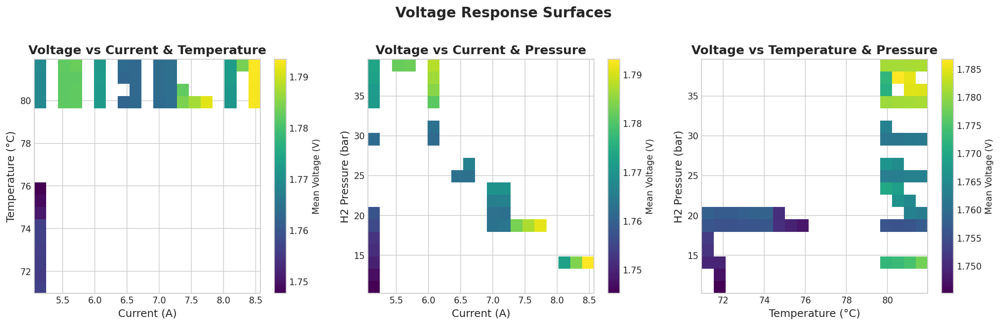
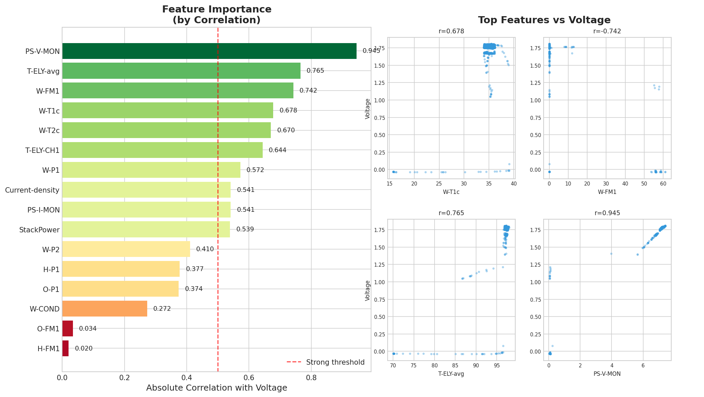
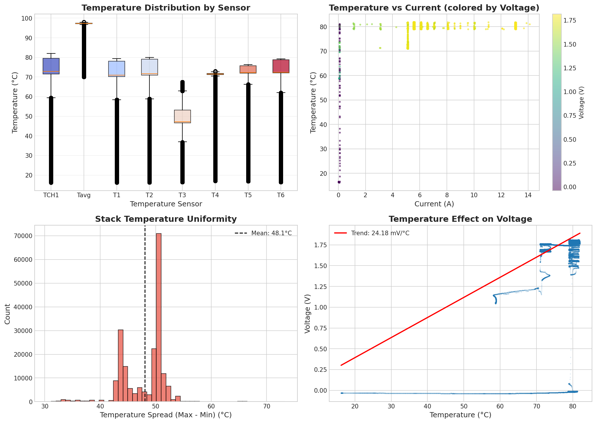

# PEM Electrolyzer PINN Optimizer

Physics-Informed Neural Networks for voltage prediction and pressure optimization in PEM water electrolyzers.


> **Key finding**: A 12-parameter physics-informed student model outperforms 350K-parameter pure ML models on out-of-distribution data, achieving 17 mV OOD MAE through knowledge distillation from a hybrid teacher.

## Table of Contents

1. [Overview](#overview)
2. [Data Sources](#data-sources)
3. [Methodology](#methodology)
4. [Sample Results](#sample-results)
5. [Getting Started](#getting-started)
6. [CLI Reference](#cli-reference)
7. [NAIC Orchestrator VM Deployment](#naic-orchestrator-vm-deployment)
8. [Troubleshooting](#troubleshooting)
9. [References](#references)
10. [License](#license)

---

## Overview

PEM water electrolysis is a key technology for green hydrogen production. Predicting cell voltage under varying operating conditions is critical for safe, efficient operation. Traditional empirical models struggle with out-of-distribution (OOD) generalization; pure ML models lack physical interpretability.

This project combines both through **Physics-Informed Neural Networks (PINNs)**:

- **Electrochemical physics** (Nernst equation, Butler-Volmer kinetics, Ohmic losses) provides the structural backbone
- **Neural network residuals** capture what the physics equations miss
- **Knowledge distillation** compresses the teacher into a compact, interpretable 12-parameter student

The [`demonstrator-v1.orchestrator.ipynb`](demonstrator-v1.orchestrator.ipynb) notebook showcases the full pipeline interactively.

### What This Repository Includes

| Component | Description |
|-----------|-------------|
| **Teacher model** (HybridPhysicsMLP) | 8 physics parameters + MLP residual (~9,354 params) |
| **Student model** (PhysicsHybrid12Param) | 12-parameter pure physics, distilled from teacher |
| **Baselines** | PureMLP, BigMLP, Transformer (for ablation comparison) |
| **Inverse solver** | Newton-Raphson optimizer for max safe pressure |
| **Digital twin** | Real-time 3D visualization with LBM fluid dynamics |
| **Full tutorial** | 9-chapter Sphinx documentation for NAIC workshops |

## Data Sources

Experimental data from NORCE Norwegian Research Centre's PEM electrolyzer test facility:

| Dataset | Description | Purpose |
|---------|-------------|---------|
| `test4_subset.csv` | Long-term stability test | Training data |
| `test2_subset.csv` | Current density sweep | OOD evaluation (current) |
| `test3_subset.csv` | Pressure swap test | OOD evaluation (pressure) |

The three datasets cover deliberately different operating regions, making OOD evaluation meaningful:



Input features: current (A), H2 pressure (bar), O2 pressure (bar), temperature (C). Target: cell voltage (V).

## Methodology

### 1. Physics-Informed Teacher

The teacher model embeds electrochemical equations directly into the network:

```
V_cell = V_nernst(T, P_H2, P_O2) + eta_act(i, T) + eta_ohm(i, T) + V_mlp_correction
```

Where `V_mlp_correction` is clamped to +/-100 mV so physics always dominates.

### 2. Knowledge Distillation

The student learns from both data and teacher predictions:

```
L = 0.1 * L_data + 0.9 * L_teacher
```

The student replaces the MLP with a 6-parameter logistic correction and adds concentration overpotential -- more physics, fewer parameters, better OOD.

### 3. Inverse Pressure Optimization

Given target voltage, current, and temperature, find maximum safe pressure via Newton-Raphson with bisection fallback, exploiting V(P) monotonicity.

### 4. Digital Twin

Real-time 3D visualization combining PINN voltage predictions with Lattice-Boltzmann fluid dynamics, served via FastAPI + WebSocket at ~10 FPS.



## Sample Results

### Training Convergence

The teacher model converges to ~14 mV validation MAE within 50 epochs:



### Prediction Quality

Validation predictions track the diagonal closely. OOD test sets (Test2, Test3) reveal where the model extrapolates:



### OOD Performance Comparison

The central result: physics-informed models dominate on OOD data despite having orders of magnitude fewer parameters.



| Model | Val MAE | Test2 (Current) | Test3 (Pressure) | OOD Avg |
|-------|---------|-----------------|-------------------|---------|
| Teacher (HybridPhysicsMLP) | ~14 mV | ~29 mV | ~10 mV | ~20 mV |
| Student (PhysicsHybrid12Param) | ~33 mV | ~16 mV | ~21 mV | ~18 mV |
| PureMLP | ~8 mV | ~120 mV | ~95 mV | ~108 mV |
| BigMLP | ~6 mV | ~110 mV | ~88 mV | ~99 mV |
| Transformer | ~5 mV | ~130 mV | ~105 mV | ~118 mV |

### Multi-Dimensional Analysis



### Data Exploration









## Getting Started

### Project Structure

```
uc2-pem-electrolyzer-pinn-optimizer/
├── demonstrator-v1.orchestrator.ipynb    # Interactive notebook
├── setup.sh / vm-init.sh                # Environment setup
├── requirements.txt                      # ML dependencies
├── dataset/                              # NORCE experimental data
│   ├── test2_subset.csv                  # OOD: current sweep
│   ├── test3_subset.csv                  # OOD: pressure swap
│   └── test4_subset.csv                  # Training data
├── scripts/pem_electrolyzer/             # Core ML pipeline
│   ├── main.py                           # CLI entry point
│   ├── models.py                         # All architectures
│   ├── trainer.py / distillation.py      # Training + distillation
│   ├── evaluation.py / ablation.py       # OOD eval + ablation
│   └── inverse.py                        # Pressure optimizer
├── digital_twin/                         # Real-time 3D twin
│   ├── digital_twin_3d.html              # Three.js frontend
│   └── backend/                          # FastAPI + LBM solver
├── tests/                                # Test suite
├── content/                              # Sphinx docs (9 chapters)
└── results/                              # Training output
```

### Installation

**NAIC Orchestrator VM** (recommended):

```bash
# 1. SSH into your VM
ssh -i ~/.ssh/naic-vm.pem ubuntu@<YOUR_VM_IP>

# 2. Init VM (first time only)
curl -O https://raw.githubusercontent.com/NAICNO/wp7-UC2-pem-electrolyzer-digital-twin/main/vm-init.sh
chmod +x vm-init.sh && ./vm-init.sh

# 3. Clone and setup
git clone git@github.com:NAICNO/wp7-UC2-pem-electrolyzer-digital-twin.git
cd uc2-pem-electrolyzer-pinn-optimizer
chmod +x setup.sh && ./setup.sh
source venv/bin/activate

# 4. Quick test
python scripts/pem_electrolyzer/main.py --mode quick-test
```

**Local machine:**

```bash
git clone git@github.com:NAICNO/wp7-UC2-pem-electrolyzer-digital-twin.git
cd uc2-pem-electrolyzer-pinn-optimizer
python3 -m venv venv && source venv/bin/activate
pip install -r requirements.txt
python scripts/pem_electrolyzer/main.py --mode quick-test
```

### Usage

```bash
# Full training (GPU recommended)
python scripts/pem_electrolyzer/main.py --mode full --device cuda --epochs 100

# Ablation study (7 experiments x 3 seeds)
python scripts/pem_electrolyzer/main.py --mode ablation

# Inverse: find max safe pressure
python scripts/pem_electrolyzer/main.py --mode inverse \
    --voltage 1.85 --current 10 --temperature 75

# Digital twin
pip install -r digital_twin/backend/requirements.txt
cd digital_twin/backend && python server.py
```

## CLI Reference

```
python scripts/pem_electrolyzer/main.py [OPTIONS]

Modes:
  --mode full          Train teacher + student, evaluate OOD (default)
  --mode quick-test    5 epochs, fast verification
  --mode teacher-only  Train only teacher model
  --mode ablation      7 experiments x 3 seeds = 21 runs
  --mode inverse       Find max safe pressure (requires checkpoint)

Training:
  --epochs N           Training epochs (default: 100)
  --batch-size N       Batch size (default: 4096)
  --lr FLOAT           Learning rate (default: 0.01)
  --alpha FLOAT        Distillation weight (default: 0.1)
  --device DEVICE      cuda/cpu/auto (default: auto)
  --seed N             Random seed (default: 42)

Inverse:
  --voltage FLOAT      Target voltage [V]
  --current FLOAT      Current [A]
  --temperature FLOAT  Temperature [C]
  --pressure FLOAT     Pressure [bar] (for voltage prediction)
  --checkpoint PATH    Model checkpoint (default: results/best_12param.pt)
  --safety-margin FLOAT Safety margin [mV] (default: 40)
  --json               Output as JSON
```

### Parameter Sweep Examples

```bash
# Sweep current at fixed conditions
for I in 5 8 10 12 15; do
  python scripts/pem_electrolyzer/main.py --mode inverse \
      --voltage 1.85 --current $I --temperature 75 --json
done

# Voltage map across operating envelope
for I in 5 8 10 12 15; do
  for P in 5 10 15 20 25 30; do
    python scripts/pem_electrolyzer/main.py --mode inverse \
        --current $I --temperature 75 --pressure $P --json
  done
done
```

## NAIC Orchestrator VM Deployment

### Jupyter Access

```bash
# On VM:
jupyter lab --no-browser --ip=0.0.0.0 --port=8888

# On laptop (SSH tunnel):
ssh -N -L 8888:localhost:8888 -L 8000:localhost:8000 -i ~/.ssh/naic-vm.pem ubuntu@<YOUR_VM_IP>
```

Open: **http://localhost:8888/lab/tree/demonstrator-v1.orchestrator.ipynb**

### Background Training

```bash
tmux new-session -d -s training 'cd ~/uc2-pem-electrolyzer-pinn-optimizer && \
  source venv/bin/activate && \
  python scripts/pem_electrolyzer/main.py --mode full --device cuda --epochs 100 \
  2>&1 | tee training.log'

tail -f training.log          # monitor
tmux attach -t training       # reattach
```

### Resources

- NAIC Portal: https://orchestrator.naic.no
- VM Workflows Guide: https://training.pages.sigma2.no/tutorials/naic-cloud-vm-workflows/
- Full tutorial: https://naicno.github.io/wp7-UC2-pem-electrolyzer-digital-twin/

## Troubleshooting

| Issue | Solution |
|-------|----------|
| SSH permission denied | `chmod 600 ~/.ssh/your-key.pem` |
| SSH timeout | Verify VM IP in orchestrator.naic.no |
| CUDA out of memory | `--batch-size 1024` |
| ModuleNotFoundError | `source venv/bin/activate` |
| No GPU detected | `nvidia-smi`; run `vm-init.sh` |
| Data not found | `ls dataset/*.csv`; run `dataset/extract_data.py` |
| Checkpoint not found | Train first: `--mode full` |
| Host key error | `ssh-keygen -R <VM_IP>` |

## References

- NORCE Norwegian Research Centre -- PEM electrolyzer experimental data
- Raissi, M. et al. (2019). Physics-Informed Neural Networks. *J. Computational Physics*, 378, 686-707
- Hinton, G. et al. (2015). Distilling the Knowledge in a Neural Network. arXiv:1503.02531

## AI Agent

If using an AI coding assistant, see [`AGENT.md`](AGENT.md) for automated setup instructions.

## License

This project uses a dual license:

- **Tutorial content** (`content/`, `*.md`, `*.ipynb`): [CC BY-NC 4.0](https://creativecommons.org/licenses/by-nc/4.0/)
- **Software code** (`*.py`, `*.html`, `*.sh`): [GPL-3.0-only](https://www.gnu.org/licenses/gpl-3.0.txt)

Copyright (c) 2026 Sigma2 / NAIC. See [LICENSE](LICENSE) for full details.
